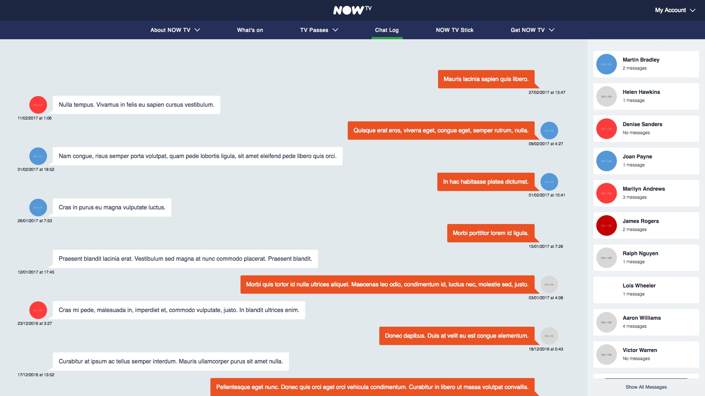

# NowTV React Chat Concept



## Tasks

1. In `service.js`, utilise the 'APIs' provided by `data.js` to create a promise resolving to an array of chatlog messages in the following format, sorted by time.
```json
[
  {
    "messageId": "12356",
    "userId": "613651251",
    "fullName": "Robin Balmforth",
    "timestamp": "2017-02-23T14:57:20.629Z",
    "email": "robin@example.com",
    "message": "Hello, World!",
    "avatar": null
  },
  ...
]
```

2. Create a view of this dataset, with the root of your React application starting in `App.js`

## Commands

Run the web application in developer mode
```bash
npm i
npm start
```
Execute Jest tests that have the `.test.js` extension
```bash
npm test
```

