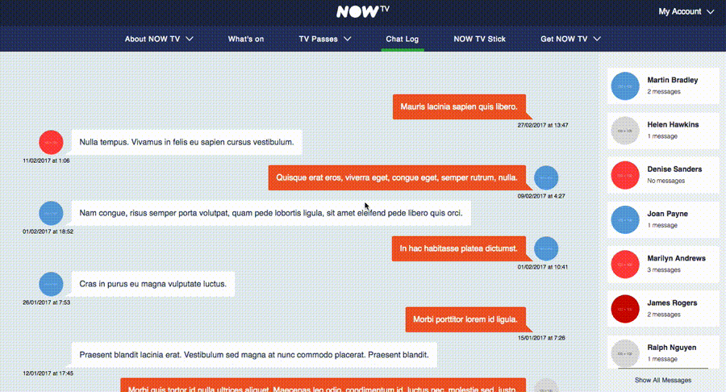

# NowTV React Chat Concept (REDUX IMPLEMENTATION)



## Commands

Run the web application in developer mode
```bash
npm i
npm start
```
Execute Jest tests that have the `.test.js` extension
```bash
npm run test
```
Execute integration tests with cypress with following commands. App must be running on port 3000 (`npm start`)
```bash
npm run cypress:run
```

## Redux implementation
With redux paradigm we store each 'screen' of the app in the containers folder. This is where all the High Order Components will be stored which will connect to the redux store and permeate the rest of the child components with required data. Depending on how big the app grows we could also create separate action and reducer files to represents various parts of our application, these reducers being then merged with the combineReducers module in the redux package

